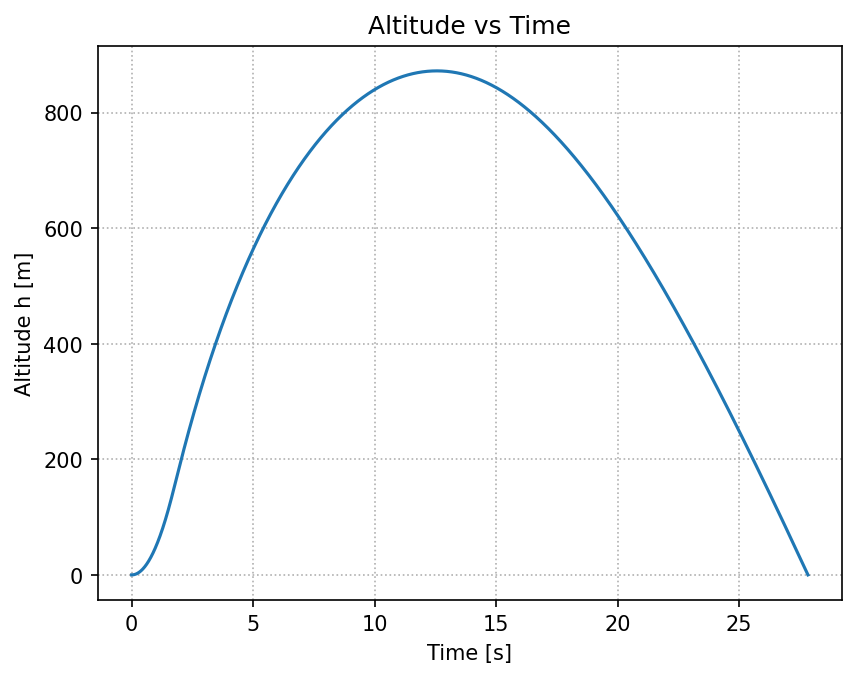
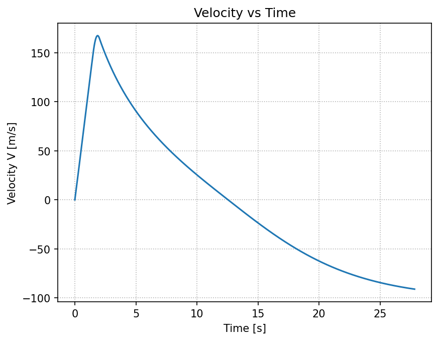
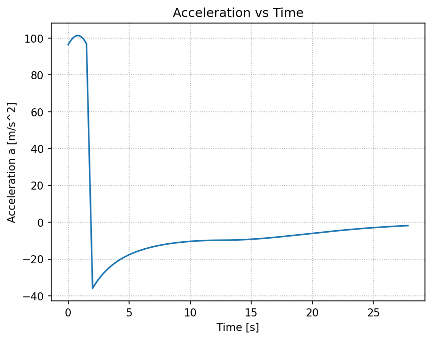
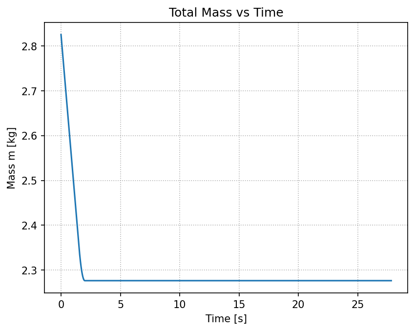
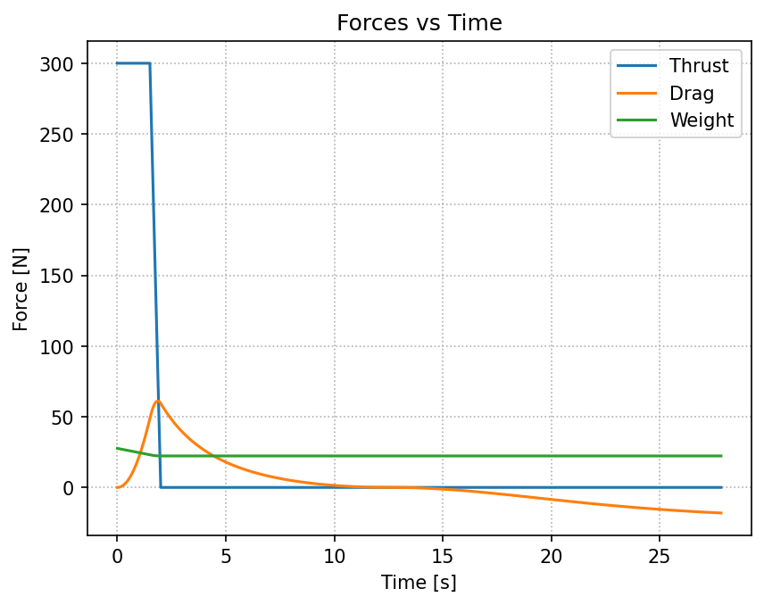

# Simulación de Trayectoria de Cohete 1-DoF — Reporte Técnico

- **Autor:** Pérez Castro Luis Ángel
- **Equipo:** Propulsión UNAM
- **Fecha:** 2025-08-31

---

## Resumen

Se presenta una simulación de trayectoria vertical con **un grado de libertad (1-DoF)** implementada en Python. El modelo integra **altitud**, **velocidad** y **masa** mediante **Euler hacia adelante** e incluye **empuje**, **arrastre aerodinámico** y **gravedad**. Con los parámetros especificados en el enunciado 1-DoF (masa seca 2.2 kg, propelente 0.625 kg, $C_D=0.75$, $D=0.086\ \mathrm{m}$, $\rho=1\ \mathrm{kg/m^3}$, $g=9.78\ \mathrm{m/s^2}$, $u_e=960\ \mathrm{m/s}$), los resultados principales fueron:

* **MECO:** $t=2.00\ \mathrm{s}$, $h=192.73\ \mathrm{m}$, $V=165.19\ \mathrm{m/s}$
* **Apogeo:** $t=12.55\ \mathrm{s}$, $h=872.34\ \mathrm{m}$
* **Atterrizaje:** $t=27.83\ \mathrm{s}$
* **Máximos:** $h_{\max}=872.34\ \mathrm{m}$, $V_{\max}=167.53\ \mathrm{m/s}$, $a_{\max}=101.35\ \mathrm{m/s^2}$

El comportamiento de las curvas concuerda con la física esperada: fuerte aceleración en la fase propulsada, **vuelo balístico** tras MECO con reducción de velocidad por arrastre, y descenso con aceleración de magnitud inferior a $g$ por la acción del arrastre.

---

## 1. Introducción

El simulador 1-DoF es una herramienta de diseño para estimar el desempeño antes del vuelo, integrando conceptos de **Propulsión, Aeroestructuras y Aviónica**. La formulación sigue las notas unificadas del MIT para cálculo de trayectorias y los parámetros del enunciado de Propulsión UNAM. 

Los objetivos fueron: 
- Implementar un integrador robusto para las EDO
- Generar gráficas y métricas solicitadas (MECO, apogeo, máximos)
- Documentar la metodología y las conclusiones físicas.

---

## 2. Modelo físico-matemático

- **Variables de estado:** $h(t)$ (altitud), $V(t)$ (velocidad), $m(t)$ (masa).
- **Fuerzas:** gravedad, arrastre aerodinámico y empuje.

### 2.1 Ecuaciones (formulación MIT)

$$
\dot h = V
$$

$$
\dot V = -\,g\;-\;\frac{1}{2}\,\frac{\rho\,V\,|V|\,C_D\,A}{m}\;+\;\frac{V}{|V|}\,\frac{\dot m_{\mathrm{fuel}}\,u_e}{m}
$$

$$
\dot m = -\,\dot m_{\mathrm{fuel}}
$$

El uso de $V|V|$ y $V/|V|$ hace consistente el signo del arrastre y del empuje en ascenso y descenso dentro del modelo académico 1-DoF.

### 2.2 Definiciones de fuerzas y datos del motor

$$
D=\tfrac{1}{2}\rho V^2 C_D A,\qquad
T=\dot m_{\mathrm{fuel}}\,u_e,\qquad
W=mg,\qquad
a=\dot V=\frac{F}{m}.
$$

Con $u_e=960\ \mathrm{m/s}$ y la curva $\dot m_{\mathrm{fuel}}(t)$ del enunciado, el empuje es:

$$
T(t)=\dot m_{\mathrm{fuel}}(t)\,u_e.
$$

**Interpolación de la curva de gasto másico.** Dadas muestras $\{(t_k,\dot m_k)\}_{k=0}^{N}$, se usa interpolación lineal a trozos:

$$
\dot m_{\mathrm{fuel}}(t)=
\begin{cases}
\dot m_k+\dfrac{\dot m_{k+1}-\dot m_k}{t_{k+1}-t_k}\,(t-t_k), & t_k\le t\le t_{k+1},\\
0, & \text{en otro caso.}
\end{cases}
$$

En tiempo discreto $t_i$:

$$
T_i=\dot m_{\mathrm{fuel},i}\,u_e,\qquad
m_{i+1}=m_i-\dot m_{\mathrm{fuel},i}\,\Delta t,
$$

y se fuerza $\dot m_{\mathrm{fuel},i}=0$ cuando $m_i\le m_{\mathrm{dry}}$ (MECO por agotamiento de propelente).

---

## 3. Método numérico

Se emplea **Euler hacia adelante** con paso constante $\Delta t$.

### 3.1 Discretización

$$
h_{i+1}=h_i+V_i\,\Delta t
$$

$$
V_{i+1}=V_i+\left(-g-\frac{1}{2}\frac{\rho\,V_i\,|V_i|\,C_D\,A}{m_i}+\frac{V_i}{|V_i|}\frac{\dot m_{\mathrm{fuel},i}\,u_e}{m_i}\right)\Delta t
$$

$$
m_{i+1}=m_i-\dot m_{\mathrm{fuel},i}\,\Delta t,\qquad
t_{i+1}=t_i+\Delta t.
$$

### 3.2 Detección de eventos (interpolación lineal)

* **MECO (fin de combustión).** Si $m_i>m_{\mathrm{dry}}$ y $m_{i+1}\le m_{\mathrm{dry}}$:

  $$
  \theta_{\mathrm{MECO}}=\frac{m_i-m_{\mathrm{dry}}}{m_i-m_{i+1}},\qquad
  t_{\mathrm{MECO}}=t_i+\theta_{\mathrm{MECO}}\Delta t.
  $$

  $$
  h_{\mathrm{MECO}}\approx h_i+\theta_{\mathrm{MECO}}(h_{i+1}-h_i),\qquad
  V_{\mathrm{MECO}}\approx V_i+\theta_{\mathrm{MECO}}(V_{i+1}-V_i).
  $$

* **Apogeo (primer cruce por cero de $V$ tras el ascenso).** Si $V_i>0$ y $V_{i+1}\le 0$:

  $$
  \theta_{\mathrm{apo}}=\frac{V_i}{V_i-V_{i+1}},\qquad
  t_{\mathrm{apo}}=t_i+\theta_{\mathrm{apo}}\Delta t,
  $$

  $$
  h_{\mathrm{apo}}\approx h_i+\theta_{\mathrm{apo}}(h_{i+1}-h_i).
  $$

* **Aterrizaje (cruce de $h=0$).** Si $h_i>0$ y $h_{i+1}\le 0$:

  $$
  \theta_{\mathrm{td}}=\frac{h_i}{h_i-h_{i+1}},\qquad
  t_{\mathrm{td}}=t_i+\theta_{\mathrm{td}}\Delta t.
  $$

### 3.3 Verificación por refinamiento de malla

Se repite la simulación con $\Delta t/2$ y se compara la discrepancia relativa

$$
E_{\mathrm{rel}}(y)=
\frac{\max_t\lvert y_{\Delta t}(t)-y_{\Delta t/2}(t)\rvert}
     {\max_t\lvert y_{\Delta t/2}(t)\rvert+\varepsilon},\qquad
\varepsilon\sim10^{-9},
$$

reduciendo $\Delta t$ hasta lograr $E_{\mathrm{rel}}(y)<1\%$ en trazas clave.

> 

---

## 4. Entradas y condiciones iniciales

* **Ambiente:** $g=9.78\ \mathrm{m/s^2}$, $\rho=1.0\ \mathrm{kg/m^3}$.
* **Vehículo:** $m_{\mathrm{dry}}=2.2\ \mathrm{kg}$, $m_{\mathrm{prop}}=0.625\ \mathrm{kg}$, $C_D=0.75$, diámetro $D=0.086\ \mathrm{m}$ $(8.6\ \mathrm{cm})$.
  Área frontal: $A=\pi(D/2)^2\approx 5.81\times 10^{-3}\ \mathrm{m^2}$.
* **Motor:** $u_e=960\ \mathrm{m/s}$; $\dot m_{\mathrm{fuel}}(t)$ de la curva del enunciado.
* **Condiciones iniciales:** $h_0=0\ \mathrm{m}$, $V_0=0\ \mathrm{m/s}$, $m_0=m_{\mathrm{dry}}+m_{\mathrm{prop}}=2.825\ \mathrm{kg}$.
* **Parámetros numéricos:** $\Delta t=0.01\ \mathrm{s}$; $t_{\max}=60\ \mathrm{s}$ o hasta **aterrizaje**.

---

## 5. Resultados

### 5.1 Métricas principales

* **MECO:** $t=2.00\ \mathrm{s}$, $h=192.73\ \mathrm{m}$, $V=165.19\ \mathrm{m/s}$
* **Apogeo:** $t=12.55\ \mathrm{s}$, $h=872.34\ \mathrm{m}$
* **Aterrizaje:** $t=27.83\ \mathrm{s}$
* **Máximos:** $h_{\max}=872.34\ \mathrm{m}$, $V_{\max}=167.53\ \mathrm{m/s}$, $a_{\max}=101.35\ \mathrm{m/s^2}$
* **Tiempo total de vuelo:** $27.83\ \mathrm{s}$

### 5.2 Interpretación de las curvas

* **Altitud vs tiempo.** Ascenso pronunciado durante la combustión; tras MECO el cohete entra en **coast** balístico hasta apogeo; descenso posterior con pendiente creciente en magnitud por la aceleración gravitatoria parcialmente compensada por el arrastre.

* **Velocidad vs tiempo.** Incremento rápido hasta un máximo cercano al fin de combustión; luego decrece por arrastre hasta cruzar $V=0$ en apogeo; se hace negativa en descenso.

* **Aceleración vs tiempo.** Picos durante el encendido (máxima relación empuje/peso), caída brusca al terminar la combustión; durante el coast la aceleración tiende a $-g$ y en descenso su magnitud es menor que $g$ por el arrastre hacia arriba.

* **Masa vs tiempo.** Disminuye linealmente durante la combustión y queda constante tras MECO.

* **Fuerzas.** El empuje sigue la curva $\dot m\,u_e$; el arrastre crece con $V^2$ y domina a altas velocidades; el peso decrece levemente durante la combustión por la pérdida de masa.

---

## 6. Discusión

* **Intuición física.** El desempeño está gobernado por la relación empuje/peso durante la combustión y por el arrastre durante la fase balística.
* **Sensibilidades.** Disminuir $C_D$ o el diámetro (por tanto $A$) incrementa el apogeo; aumentar $u_e$ o el flujo másico $\dot m$ eleva $V_{\max}$ y la altura alcanzada.
* **Precisión numérica.** El esquema de Euler es consistente; el refinamiento de malla con $\Delta t/2$ produce cambios pequeños en $h(t)$ y $V(t)$, validando la resolución elegida.
* **Limitaciones.** Atmósfera de densidad constante y $C_D$ constante.

---

## 7. Conclusiones

Con los parámetros del documento, el cohete alcanza aproximadamente **0.87 km** de apogeo. El perfil temporal de altitud, velocidad, aceleración y fuerzas es coherente con la teoría: empuje dominante al inicio, **coast** balístico tras MECO y descenso moderado por arrastre. El simulador 1-DoF implementado satisface los requisitos de la actividad.

---

## Referencias

1. MIT Unified Engineering — *Trajectory Calculation (Lab 2 Lecture Notes).*
2. Propulsión UNAM — *Actividad 1-DoF — Reclutamiento: entregables y parámetros.*
3. Documentación completa en mi repositorio: [1DoF](https://github.com/luuuisc/1dof-rocket-simulator)

---

## Apéndice A. Nomenclatura

$t$ tiempo; $h$ altitud; $V$ velocidad; $F$ fuerza total; $D$ arrastre; $T$ empuje; $g$ gravedad; $m$ masa; $C_D$ coeficiente de arrastre; $A$ área de referencia; $\rho$ densidad del aire; $\dot m_{\mathrm{fuel}}$ gasto másico de propelente; $u_e$ velocidad de eyección; $\Delta t$ paso de tiempo.
